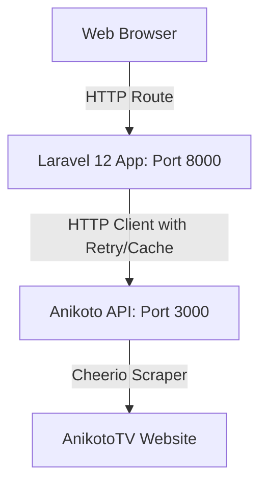

# Anikoto Streaming Integration Guide

This guide explains how to start and manage both the Anikoto API server and the AniVerse Laravel application.

---

## 1. Startup Commands

Open two separate terminal windows/tabs:

### Terminal 1: Anikoto API Server
Starts the Express.js scraping server on port `3000`.

```bash
cd c:\laragon\www\Anikoto-API
npm start
```

### Terminal 2: AniVerse Laravel Application
Starts the local development PHP server on port `8000`.

```bash
cd c:\laragon\www\Anime
php artisan serve
```

---

## 2. Integrated Architecture

The application communicates with the scrapers using a decoupled architecture:



### Integrated Endpoints:

| Feature | Route URL | Controller Action | Description |
|---------|-----------|-------------------|-------------|
| **Home** | `/` | `HomeController@index` | Anime portal dashboard with carousel and rows. |
| **Trending** | `/trending` | `AnimeController@trending` | Currently trending anime series. |
| **Latest** | `/latest` | `AnimeController@latest` | Recently updated and released episodes. |
| **Search** | `/search` | `SearchController@index` | Flexibly filter and search catalog. |
| **Anime Details** | `/anime/{id}` | `AnimeController@show` | Visual detail page mapping cover info to episode listings. |
| **Episode List** | `/anime/{slug}/episodes` | `EpisodeController@index` | Scraped episode catalog grid for streaming. |
| **Watch Page** | `/watch/{slug}/{episode}` | `PlayerController@watch` | Interactive viewing deck with autoplay, player, and related suggestions. |
| **Player Page** | `/player/{slug}/{episode}` | `PlayerController@player` | Clean sandboxed iframe frame wrapping the selected streaming server. |

---

## 3. Configuration & Cache

- **Base URL Configuration**: Defined in [config/services.php](file:///c:/laragon/www/Anime/config/services.php) as `services.anikoto.base_url` pointing to `ANIKOTO_API_URL` in your `.env`.
- **Caching**: The [AnikotoService](file:///c:/laragon/www/Anime/app/Services/AnikotoService.php) automatically caches response payloads:
  - Schedules & Search results: cached for **5 minutes**.
  - Anime info & Episodes lists: cached for **30 minutes**.
  - Page ID lookups: cached for **1 hour**.
- **Error Mitigation**: Built-in 3x retry exponential backoff on HTTP requests.
